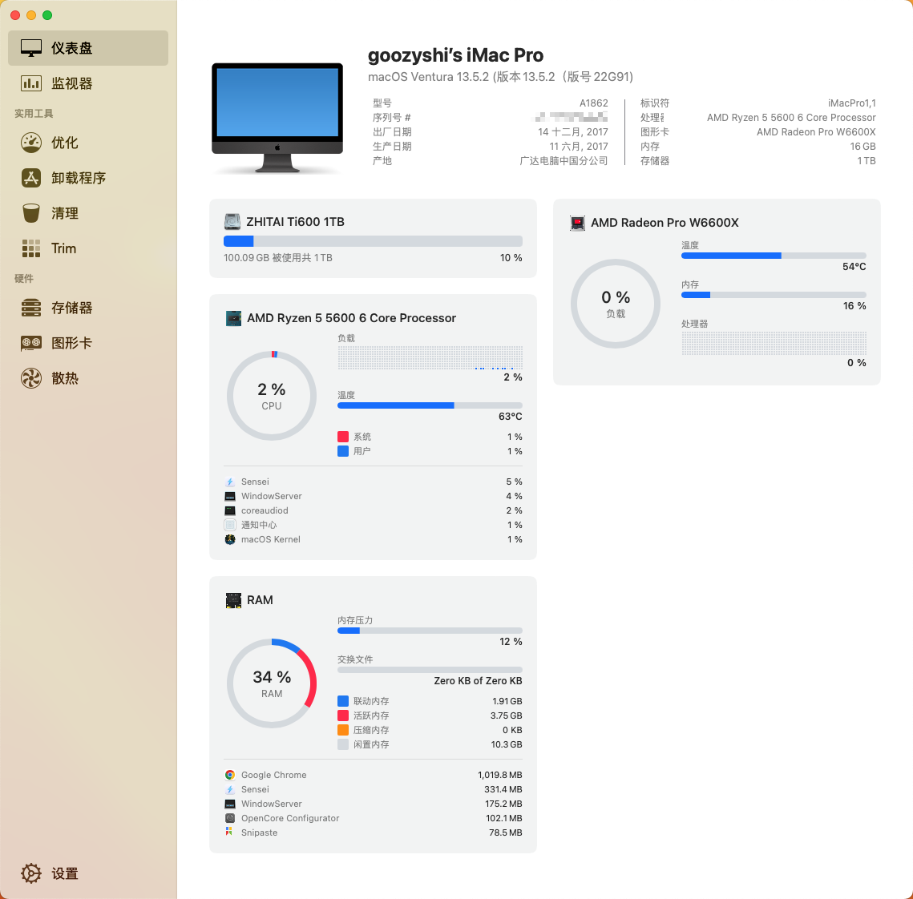
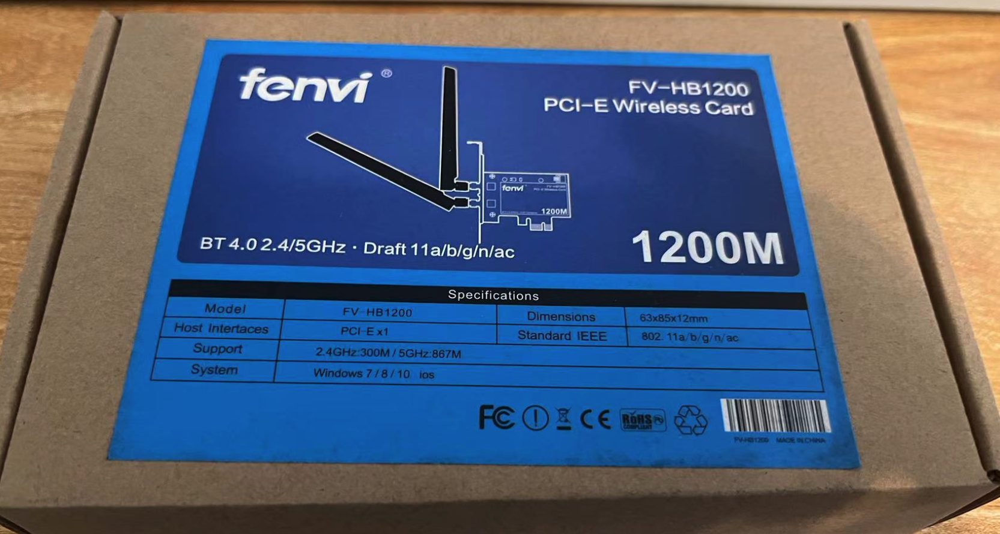
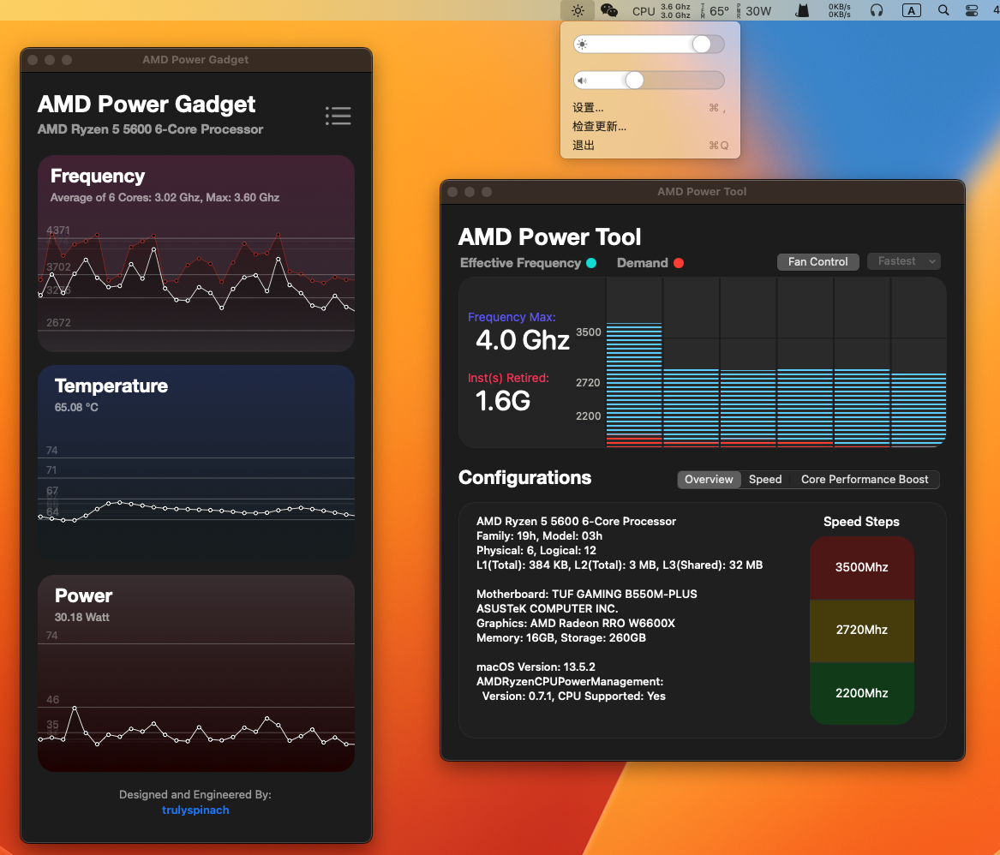
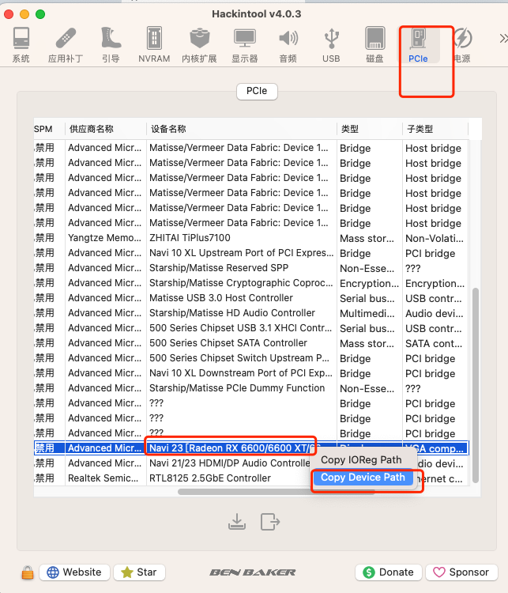
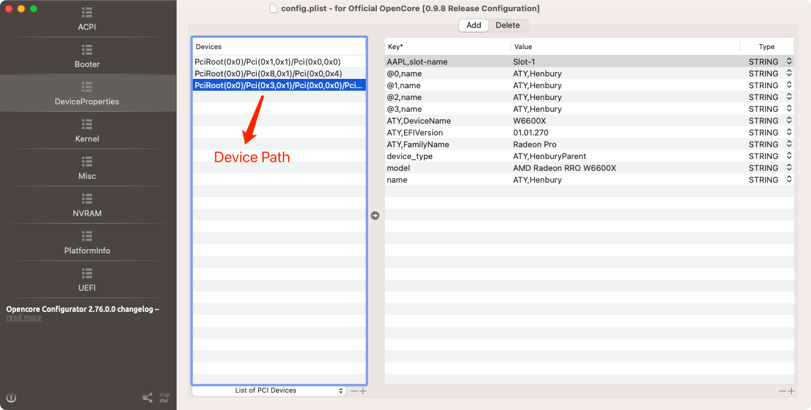

****# RYZENTOSH-5600-550M-RX6600

👏 **AMD YES** ！基于 OpenCore0.98 的 Ryzen 5600 + Asus B550M-plus + Rx6600 安装的黑苹果，主要用来敲代码，刚需功能已完善，欢迎 star 完善。



## 💻 设备信息

<br>

[](https://github.com/acidanthera/OpenCorePkg) [](https://www.apple.com/macos/ventura)

</br>

| **设备**     | **型号**                                                                                                                                                                              |
| ------------ | ------------------------------------------------------------------------------------------------------------------------------------------------------------------------------------- |
| **CPU**      | 3,5 GHz AMD Ryzen 5 5600 6-Core Processor                                                                                                                                             |
| **显卡**     | 撼讯 AMD Radeon RX 6600 8 GB                                                                                                                                                          |
| **内存**     | 16GB KingBank DDR4 2666MHZ                                                                                                                                                            |
| **主板**     | [ASUS TUF GAMING B550M-PLUS](https://www.asus.com.cn/motherboards-components/motherboards/tuf-gaming/tuf-gaming-b550m-plus/)                                                          |
| **SSD**      | ZHITAI Ti600 1TB                                                                                                                                                                      |  |
| **Ethernet** | Realtek RTL8125 2.5GbE Controller （主板自带）                                                                                                                                        |
| **Audio**    | Realtek ALCS1200A (**layout-id=11**， 其他型需要更改layout-id或者 启动项的 alcid，可以查询[AppleALC-Supported codecs](https://github.com/acidanthera/applealc/wiki/supported-codecs)) |

## ✅ 功能

-  CPU power management
-  Graphics acceleration
-  Ethernet
-  Keyboard & Mouse
-  USB ports
-  HDMI video & audio output.
-  iCloud & App Store & iMessage

## ❌ 问题

-  **Wi-Fi/Bluetooth**： 之前买了个 **Fenvi FV-HB1200** ，WIFI免驱，隔空投送、蓝牙需要驱动，实测 **WIFI 可以正常运行但蓝牙经常断连**，基本1分钟左右自动断开，**体验极差**，因为我的需求只是连接我的 JBL 音箱 放个响，后面直接买个有线耳机搞定了。

​	

-  airDrop： 没有蓝牙所以没有隔空投送

-  microphone： 麦克风

## 🎉一些优化

### 安装 wifi 蓝牙驱动
- 首先需要[**定制USB**](https://apple.sqlsec.com/6-%E5%AE%9E%E7%94%A8%E5%A7%BF%E5%8A%BF/6-1.html)，建议 Windows 下定制端口生成 [UTBMap.kext](https://github.com/USBToolBox/tool) + [USBToolBox.kext](https://github.com/USBToolBox/kext) 进行定制，MacOS 下则可以选择 [USBMAP](https://github.com/corpnewt/USBMap) 进行定制，最终生成 **USBMAP.kext** 文件。
- 生成的xxmapkext 最后要和 ACPI 的 SSDT-EC-USBX-DESKTOP 一起勾选 Enable 使用
- USB端口定制后，USB下面会显示BCM的设备名称
- 安装博通蓝牙驱动 [BrcmPatchRAM](https://github.com/acidanthera/BrcmPatchRAM):
  - BlueToolFixup.kext （BigSur 及之前使用 BrcmBluetoothInjector.kext）
  - BrcmFirmwareData
  - BrcmPatchRAM3.kext （10.13 使用）
- 安装 Intel 蓝牙如 AX210，使用 [IntelBluetoothFirmware](https://github.com/OpenIntelWireless/IntelBluetoothFirmware)
  - BlueToolFixup.kext
  - IntelBluetoothFirmware.kext
  - IntelBTPatcher.kext
-  安装蓝牙后，隔空投送则使用 [AirportBrcmFixup](https://github.com/acidanthera/AirportBrcmFixup) 或者 [AirportItlwm](https://github.com/OpenIntelWireless/itlwm)，后者是[z大](https://github.com/zxystd)用于解决intel网卡的。

### 性能监控

- CPU 监控：[AMD POWER GADGET App](https://github.com/trulyspinach/SMCAMDProcessor) ⚠️ 需要**搭配 SMCAMDProcessor.kext** 使用
- 显示器亮度调节 🔅：[MonitorControl App](https://github.com/MonitorControl/MonitorControl)



###   RX6600 显卡仿冒

获取**Device Path**:



```xml
<key>这里写你显卡的实际的设备路径(Hackintool PCIE里面可以看到)</key>
  <dict>
    <key>@0,name</key>
    <string>ATY,Henbury</string>
    <key>@1,name</key>
    <string>ATY,Henbury</string>
    <key>@2,name</key>
    <string>ATY,Henbury</string>
    <key>@3,name</key>
    <string>ATY,Henbury</string>
    <key>ATY,DeviceName</key>
    <string>W6600X</string>
    <key>ATY,EFIVersion</key>
    <string>01.01.270</string>
    <key>ATY,FamilyName</key>
    <string>Radeon Pro</string>
    <key>device_type</key>
    <string>ATY,HenburyParent</string>
    <key>model</key>
    <string>AMD Radeon RRO W6600X</string>
    <key>name</key>
    <string>ATY,Henbury</string>
  </dict>
```

在 OpenCore Configurator 应该是这样的：



## 致谢

- 镜像来源：[黑果小兵的部落阁](https://blog.daliansky.net/macOS-Monterey-12.5.1-21G83-Release-version-with-OC-0.8.4-CLOVER-5148-and-FirPE-original-image.html)
- 教程入门：[国光的黑苹果安装教程：手把手教你配置 OpenCore](https://github.com/sqlsec/Hackintosh/tree/main)
